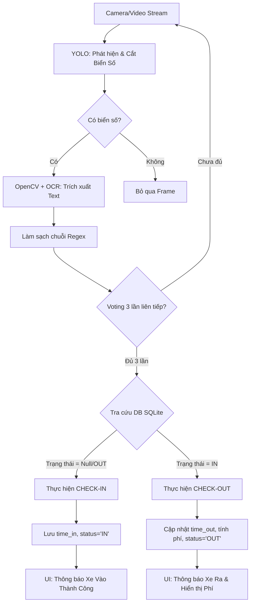

# Lộ trình Phát triển Dự án Smart Parking (5 Tuần)

Dự án Xây dựng hệ thống Nhận diện Biển số xe (License Plate Recognition - LPR) kết hợp YOLO (phát hiện đối tượng), OpenCV (xử lý ảnh) và PaddleOCR (nhận dạng ký tự).

---

## 🎯 1. Mục tiêu dự án
- **Hệ thống hóa toàn diện:** Xây dựng một hệ thống Quản lý Bãi xe Thông minh (Smart Parking) tích hợp công nghệ nhận diện bằng AI.
- **Tự động hóa:** Xử lý luồng Check-in/Check-out tự động (phát hiện xe, đọc biển số, lưu thời gian, tính toán phí gửi).
- **Quản lý lưu trữ:** Triển khai cơ sở dữ liệu SQLite để lưu vết (logs) xe ra vào, hỗ trợ truy xuất và đối soát doanh thu.
- **Giao diện trực quan:** Xây dựng dashboard giám sát (UI) thời gian thực bằng Streamlit phục vụ cho bảo vệ và người quản lý.

---

## 🛠️ 2. Công nghệ & Công cụ (Tech Stack & Tools)

### 2.1. Ngôn ngữ & Framework
- **Ngôn ngữ:** Python 3.9+ (Khuyến nghị 3.11)
- **Deep Learning Framework:** PyTorch (dành cho các phiên bản YOLO mới).
- **Computer Vision:** OpenCV (`cv2`).

### 2.2. Các module chính
1. **Phát hiện biển số (Object Detection):**
   - **Mô hình:** YOLOv8 (Ultralytics). Xử lý frame video thời gian thực để tìm vùng biển số.
   - **Model đang dùng:** `models/best_second.pt` — custom train trên dataset biển số Việt Nam.
2. **Xử lý ảnh & OCR (Image Processing & Recognition):**
   - **Công cụ:** OpenCV (resize, CLAHE tăng tương phản) và PaddleOCR (đọc chuỗi ký tự).
3. **Quản lý Dữ liệu (Database Management):**
   - **Công cụ:** SQLite3 (WAL mode cho đọc ghi đồng thời an toàn).
   - **Nhiệm vụ:** Lưu trữ bảng `parking_logs` với các trường thông tin: Biển số, Thời gian vào, Thời gian ra, Trạng thái (IN/OUT), Phí gửi xe.
4. **Giao diện Giám sát (Dashboard UI):**
   - **Công cụ:** Streamlit.
   - **Nhiệm vụ:** Hiển thị camera stream, trạng thái xử lý xe, in thông báo Check-in/Check-out và thống kê phí.

### 2.3. Tools & Environment
- **IDE:** VS Code / PyCharm / Jupyter Notebook (để test/train model).
- **Quản lý môi trường:** `venv` (khuyên dùng) hoặc Anaconda.
- **Đánh dấu dữ liệu (Annotation Tool):** Roboflow (khuyên dùng), CVAT, hoặc LabelImg.
- **Phần cứng:** Ưu tiên có GPU (NVIDIA CUDA) để train/test mô hình YOLO nhanh hơn.

---

## 🗺️ 3. Lộ trình phát triển (Roadmap) - 5 Tuần

### Tuần 1-2: Xây dựng Core AI (Hoàn thành ✅)
- Huấn luyện YOLO nhận diện biển số (`best.pt`, `best_second.pt`).
- Thiết lập Pipeline xử lý ảnh bằng OpenCV.

### Tuần 3: Tích hợp OCR & Cơ sở dữ liệu (Hoàn thành ✅)
- Triển khai PaddleOCR để trích xuất text.
- Thiết kế Schema SQLite (Bảng `parking_logs` + `parking_config`).
- Viết hàm `process_vehicle()` xử lý Check-in/Check-out tự động.

### Tuần 4: Phát triển Giao diện & Logic tính phí (Hoàn thành ✅)
- Xây dựng Dashboard Streamlit (`app_trial.py`).
- Cài đặt công thức tính phí lũy tiến theo thời gian gửi.
- Xử lý các trường hợp ngoại lệ (Biển số lỗi, bãi đầy, xe chưa có thông tin vào).
- Triển khai kiến trúc Multiprocessing (Camera + OCR Process + Streamlit).

### Tuần 5: Kiểm thử & Đóng gói (Đang tiến hành ⏳)
- Test thực tế với Video bãi xe.
- Hoàn thiện báo cáo và Slide thuyết trình.

---

## 📋 4. Sơ đồ Pipeline xử lý Bãi xe (Smart Parking Workflow)



---

## 🛠️ 5. Các vấn đề thường gặp (Gotchas / Challenges)
1. **Biển số bị chói sáng / phản quang (Ban đêm):** Giải quyết bằng cách dùng CLAHE (tăng tương phản thích ứng) trước khi đưa vào OCR.
2. **Biển bị mờ do xe chạy tốc độ cao (Motion Blur):** Tương đối khó xử lý bằng OpenCV thuần, ưu tiên cải thiện chất lượng Camera đầu vào hoặc áp dụng các model AI khôi phục ảnh (Super Resolution).
3. **Biển vuông (2 dòng) bị OCR đọc sai thứ tự:** Thuật toán phân cụm dòng theo trục Y (`_sort_and_merge_paddle`) sắp xếp ký tự từ trên xuống dưới, trái sang phải dựa trên tọa độ hộp chữ.
4. **Nhầm lẫn ký tự:** Sử dụng bảng ánh xạ `CHAR_TO_NUM` / `NUM_TO_CHAR` dựa trên quy tắc vị trí biển số VN (vị trí 0-1: bắt buộc số, vị trí 2: bắt buộc chữ, vị trí 4+: bắt buộc số).
5. **Spam quét liên tục:** Cơ chế Voting (`CONFIRM_THRESHOLD = 3`) + Cooldown (`OCR_COOLDOWN = 0.3s`) ngăn gửi kết quả nhiễu lên Dashboard.

---

## 🚉 6. Cấu trúc Module của Hệ thống Bãi xe (Smart Parking Modules)

Hệ thống được chia thành 4 Module hoạt động song song để quản lý toàn diện quy trình:

| Module | Tên | Công nghệ | Nhiệm vụ |
|--------|-----|-----------|----------|
| **Module 1** | Capture (Camera) | OpenCV / Streamlit | Quản lý luồng video (Real-time feed) từ cổng vào/ra. |
| **Module 2** | AI Core (LPR) | YOLO + PaddleOCR | Xác định và trích xuất chuỗi biển số từ khung hình. |
| **Module 3** | DB Logic (Ticket) | SQLite3 + Python | Quyết định Check-in/Check-out, ghi nhận log và tính tiền. |
| **Module 4** | Dashboard (UI) | Streamlit + Plotly | Giám sát trạng thái hoạt động, báo cáo doanh thu. |

### 🚉 Module 1 & 2 — AI LPR (Cốt lõi nhận diện)
- Luồng video được quét mỗi `YOLO_INTERVAL = 3` frame để giảm tải.
- **YOLOv8** (model `best_second.pt`) phát hiện hộp giới hạn biển số.
- Vùng biển số được cắt, resize, tăng độ tương phản (CLAHE trong không gian YUV) bằng **OpenCV** và chuyển thành văn bản bằng **PaddleOCR** (chạy trên Process riêng).
- **RegEx** validate kết quả, bảng ánh xạ sửa lỗi vị trí ký tự.
- **Voting** tích lũy 3 lần liên tiếp → gửi lên DB.

### 🚉 Module 3 — DB & Billing Logic (Trạm ra/vào)
- Module kiểm tra chuỗi biển số với bảng `parking_logs` trong cơ sở dữ liệu.
- **Kịch bản Check-in (Vào):** Nếu biển số chưa có trong DB hoặc trạng thái cũ là 'OUT'. Kiểm tra sức chứa (`MAX_CAPACITY`). Lưu `ticket_id`, `plate_number`, `time_in` (thời gian hiện tại), và đánh dấu `status = 'IN'`.
- **Kịch bản Check-out (Ra):** Nếu biển số đang có trạng thái 'IN'. Lấy `time_in` đối chiếu với `time_out` (hiện tại) để tính tổng số phút gửi. Tính phí lũy tiến và cập nhật `status = 'OUT'`.

### 🚉 Module 4 — Giám sát & Báo cáo
- Giao diện Dashboard hiển thị bảng danh sách các xe đang đỗ, thống kê doanh thu.
- Auto-refresh mỗi `AUTO_REFRESH_SEC = 5` giây.
- Hiển thị biểu đồ doanh thu bằng Plotly.

---

## 📁 7. Cấu trúc Thư mục Dự án (File Structure)

```
LPR_Project/
├── parking.db                # File Database lưu vết xe ra vào
├── yolov8n.pt                # Model YOLO pre-trained gốc (auto download)
├── models/
│   ├── best.pt               # YOLO model custom v1
│   └── best_second.pt        # YOLO model custom v2 (đang sử dụng)
├── modules/
│   ├── config.py             # Cấu hình tập trung toàn hệ thống
│   ├── database_manager.py   # Logic DB: Tính phí, Check-in/Check-out, Semi-manual
│   ├── detection.py          # Logic nhận diện biển số (gọi YOLO, trả bbox)
│   ├── processing.py         # Tiền xử lý ảnh (Resize, YUV, CLAHE)
│   ├── ocr_engine.py         # Nhận dạng chữ (PaddleOCR + sửa lỗi vị trí + RegEx)
│   ├── ocr_worker_proc.py    # Worker chạy OCR trong process riêng (Multiprocessing)
│   ├── live_test.py          # Script chạy camera ngoài (YOLO + OCR + Voting)
│   └── test_img.py           # Script test nhanh trên ảnh tĩnh
├── app_trial.py              # File chính — Giao diện Streamlit đầy đủ tính năng
├── requirements.txt          # Danh sách thư viện cần cài đặt
├── tech_docs/                # Tài liệu kỹ thuật chuyên sâu (6 file)
└── Implementation_Guide.md   # File hướng dẫn chi tiết từng bước
```

> **Quy tắc chính:** Mỗi `module` trong thư mục `modules/` phải export ít nhất 1 hàm rõ ràng. `app_trial.py` chỉ import và gọi các hàm đó, không chứa logic xử lý ảnh hay OCR trực tiếp.

---

## ⚡ 8. Giải pháp cho các vấn đề thực tế

### 🔴 Vấn đề 1: Train dữ liệu nhanh để nhận diện Real-time

| Giải pháp | Chi tiết |
|-----------|---------| 
| **Dùng model Pre-trained** | Dùng `yolov8n.pt` (Nano) — bản nhẹ nhất, FPS cao, không cần GPU mạnh. |
| **Dataset sẵn có** | Tìm "Vietnamese License Plate" trên **Roboflow** — đã gán nhãn sẵn, bỏ qua bước labeling thủ công. |
| **Train trên Cloud** | Dùng **Google Colab** (GPU miễn phí) — train xong trong vài tiếng thay vì vài ngày. |

### 🟠 Vấn đề 2: Xử lý Trùng lặp Biển số & Lưu Database

- **Vấn đề Quét nhiều lần (Spam Scan):** Xe dừng ở cổng có thể bị hệ thống quét nhiều lần trong 1 giây, dẫn đến lưu nhiều bản ghi Check-in.
- **Giải pháp — Voting + Cooldown:** Hệ thống chỉ ghi biển số khi **kết quả xuất hiện ổn định 3 lần liên tiếp** (`CONFIRM_THRESHOLD = 3`). Kết hợp `OCR_COOLDOWN = 0.3s` giữa các lần gửi crop cho OCR. Phát hiện biển số mới qua `BBOX_JUMP_THRESHOLD = 60px`.
- **Vấn đề Xe mất biển / Lỗi OCR:** Yêu cầu bảo vệ nhập biển số bằng tay thông qua một input box trên UI nếu AI không đọc được hoặc đọc sai.

### 🟢 Vấn đề 3: Giải pháp cho người mới (Dễ triển khai)

| Vấn đề | Giải pháp nhanh |
|--------|----------------|
| Giao diện web | **Streamlit** — viết Python thuần, không cần HTML/CSS/JS. |
| Đọc chữ (OCR) | **PaddleOCR** — hỗ trợ đa ngôn ngữ, ổn định ngay cả ảnh hơi mờ. |
| Real-time quá chậm | **Plan B:** Upload Video → Xử lý → Trả kết quả (thay vì live webcam). |

### 🔵 Kỹ thuật nâng cao: Giảm Delay khi chạy Video/Webcam

```
Chiến lược giảm tải (đã triển khai):
1. Skip Frames  →  YOLO: mỗi 3 frame | OCR: cooldown 0.3s + chỉ gửi khi Queue trống
2. Multi-processing  →  Process 1: Camera + YOLO | Process 2: PaddleOCR (tránh GIL)
3. Grayscale IPC  →  Chuyển ảnh sang 1 kênh trước khi truyền qua Queue (giảm 3x payload)
4. CameraStream  →  Thread đọc camera bất đồng bộ, buffer size = 1 (luôn lấy frame mới nhất)
```

---
*Bản kế hoạch này cung cấp một cái nhìn tổng thể và có thể được điều chỉnh linh hoạt độ khó, sâu của từng Phase tuỳ thuộc vào thời gian và yêu cầu cụ thể của bạn.*
