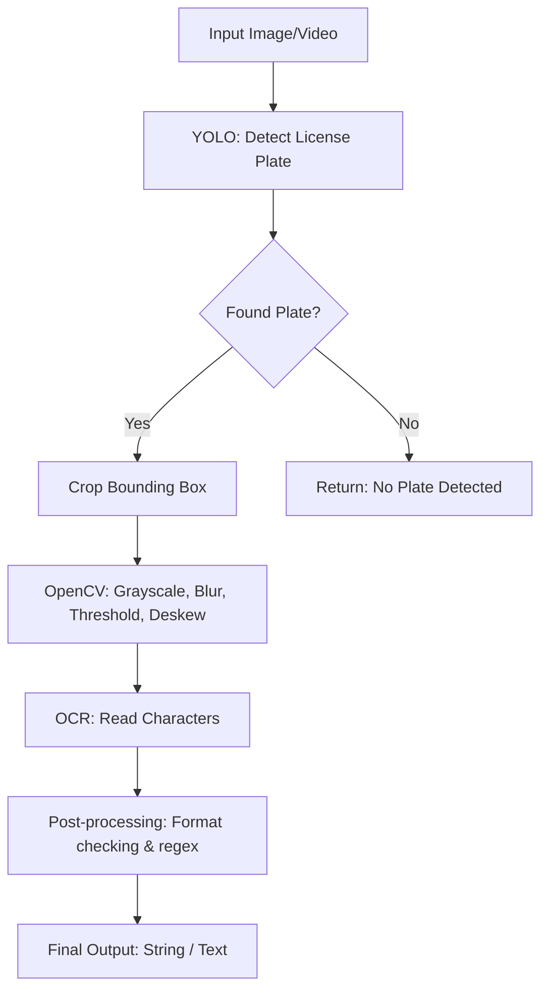

# 🚀 Kế hoạch & Roadmap Dự án Nhận diện Biển số xe (LPR)

Dự án Xây dựng hệ thống Nhận diện Biển số xe (License Plate Recognition - LPR) kết hợp YOLO (phát hiện đối tượng), OpenCV (xử lý ảnh) và OCR (nhận dạng ký tự).

---

## 🎯 1. Mục tiêu dự án
- Xây dựng một pipeline hoàn chỉnh từ đầu vào (ảnh/video) đến đầu ra (chuỗi ký tự biển số xe).
- Tối ưu hóa tốc độ và độ chính xác của mô hình để có thể chạy được trên thời gian thực (real-time) hoặc gần thời gian thực.
- Xây dựng giao diện (UI) cơ bản hoặc API để tương tác với hệ thống.

---

## 🛠️ 2. Công nghệ & Công cụ (Tech Stack & Tools)

### 2.1. Ngôn ngữ & Framework
- **Ngôn ngữ:** Python 3.9+
- **Deep Learning Framework:** PyTorch (dành cho các phiên bản YOLO mới).
- **Computer Vision:** OpenCV (`cv2`).

### 2.2. Các module chính
1. **Phát hiện biển số (Object Detection):**
   - **Mô hình:** YOLOv8 (Ultralytics) hoặc YOLOv11 (mới nhất). Bản thân YOLO cực kỳ nhanh và mạnh mẽ trong việc phát hiện bounding box của biển số.
   - **Dataset (Dữ liệu):** Roboflow (tìm kiếm các tập dữ liệu "License Plate" hoặc tự crawl/gán nhãn).
2. **Xử lý ảnh (Image Processing):**
   - **Công cụ:** OpenCV, Numpy.
   - **Kỹ thuật:** Cắt ảnh (Crop), Chuyển ảnh xám (Grayscale), Nhị phân hóa (Binarization/Thresholding), Giảm nhiễu (Gaussian Blur), Morphological operations (Dilation, Erosion) để làm rõ nét chữ.
3. **Nhận dạng ký tự (OCR - Optical Character Recognition):**
   - **Công cụ:** Tesseract OCR, EasyOCR, hoặc PaddleOCR.
   - *Khuyến nghị:* EasyOCR hoặc PaddleOCR vì hỗ trợ nhận dạng chữ trong điều kiện thực tế (ngoài trời, ánh sáng phức tạp) tốt hơn Tesseract.
4. **Giao diện/Triển khai (Deployment & UI):**
   - **Giao diện:** Streamlit hoặc Gradio (nhanh chóng, tiện lợi cho các ứng dụng AI) hoặc PyQt/Tkinter (nếu làm ứng dụng desktop truyền thống).
   - **API Backend (Tuỳ chọn):** FastAPI hoặc Flask.

### 2.3. Tools & Environment
- **IDE:** VS Code / PyCharm / Jupyter Notebook (để test/train model).
- **Quản lý môi trường:** Anaconda hoặc `venv`.
- **Đánh dấu dữ liệu (Annotation Tool):** CVAT, LabelImg, hoặc Roboflow (khuyên dùng Roboflow).
- **Phần cứng:** Ưu tiên có GPU (NVIDIA CUDA) để train/test mô hình YOLO nhanh hơn.

---

## 🗺️ 3. Lộ trình phát triển (Roadmap) - Đẩy nhanh tiến độ (5 Tuần)

### 📌 Phase 1: Chuẩn bị Dataset & Train mô hình Detection (Tuần 1)
**Mục tiêu:** Rút ngắn thời gian bằng cách tận dụng tài nguyên có sẵn để YOLO nhận diện chính xác vị trí biển số.
- **Công việc:**
  - Setup môi trường nhanh (Python, PyTorch, OpenCV, Ultralytics).
  - *Mẹo:* Sử dụng trực tiếp Dataset biển số xe Việt Nam đã gán nhãn sẵn trên **Roboflow** để bỏ qua bước gán nhãn thủ công.
  - Train mô hình YOLO (dùng YOLOv8n để train nhanh trên Google Colab hoặc máy cá nhân).
  - Xuất mô hình sang định dạng `.pt`.
- **Kết quả:** Code đầu vào 1 bức ảnh/video, đầu ra trả về toạ độ Bounding box của biển số.

### 📌 Phase 2: Cắt & Xử lý ảnh - Image Processing (Tuần 2)
**Mục tiêu:** Xử lý ảnh để làm rõ ký tự nhất có thể trước khi đưa vào OCR.
- **Công việc:**
  - Viết script cắt vùng ảnh (Crop ROI) từ toạ độ của YOLO.
  - Xử lý ảnh bằng OpenCV: Chuyển Grayscale, tăng tương phản CLAHE, Thresholding (tách nền chữ).
  - Căn chỉnh nghiêng (Deskewing) nếu biển số bị lệch góc.
- **Kết quả:** Ảnh đầu ra là phần biển số đã được làm sạch, sẵn sàng cho OCR.

### 📌 Phase 3: Tích hợp OCR & Logic Hậu xử lý (Tuần 3 - Tuần 4)
**Mục tiêu:** Đọc văn bản từ ảnh và xử lý dữ liệu thô thành chuỗi ký tự chính xác.
- **Tuần 3: Tích hợp thư viện nhận dạng**
  - Đưa ảnh đã xử lý ở Phase 2 vào EasyOCR hoặc PaddleOCR.
  - Xử lý bài toán xếp dòng: Phân loại biển dài (1 dòng) và biển vuông (2 dòng) dựa vào tỉ lệ khung hình (Aspect Ratio) để nối chữ cho đúng thứ tự.
- **Tuần 4: Hậu xử lý (Post-processing) & Gộp Pipeline**
  - Dùng Regular Expression (RegEx) dựa trên luật biển số Việt Nam để sửa lỗi sai phổ biến (VD: OCR nhầm `8` thành `B`, `0` thành `D` ở phần số).
  - Đóng gói toàn bộ luồng chạy thành 1 pipeline duy nhất: `Image -> YOLO -> OpenCV -> OCR -> Final String`.
- **Kết quả:** Trả về kết quả chuỗi Text cuối cùng chính xác (VD: `30G12345`).

### 📌 Phase 4: Giao diện (UI) & Hoàn thiện (Tuần 5)
**Mục tiêu:** Trực quan hoá hệ thống để demo và nghiệm thu.
- **Công việc:**
  - Dùng **Streamlit** (viết giao diện hoàn toàn bằng Python rất nhanh) tạo UI cho phép Upload ảnh/video.
  - Hiển thị kết quả ra màn hình (Ảnh gốc kèm Bounding box + Text biển số).
  - Viết tài liệu `README.md` hướng dẫn cách chạy.
- **Kết quả:** Ứng dụng web cơ bản có thể demo ngay lập tức.

---

## 📋 4. Sơ đồ Pipeline xử lý (Workflow)



---

## 🛠️ 5. Các vấn đề thường gặp (Gotchas / Challenges)
1. **Biển số bị chói sáng / phản quang (Ban đêm):** Giải quyết bằng cách dùng `cv2.equalizeHist` hoặc các thuật toán cân bằng sáng trước khi đưa vào OCR.
2. **Biển bị mờ do xe chạy tốc độ cao (Motion Blur):** Tương đối khó xử lý bằng OpenCV thuần, ưu tiên cải thiện chất lượng Camera đầu vào hoặc áp dụng các model AI khôi phục ảnh (Super Resolution).
3. **Biển vuông (2 dòng) bị OCR đọc sai thứ tự:** Cần viết code logic tính toán toạ độ chiều dọc (Y-coordinate) của các ký tự để nối chuỗi (dòng trên trước, dòng dưới sau).
4. **Nhầm lẫn ký tự:** Cần sử dụng Regular Expression (RegEx) dựa trên quy tắc biển số (Ví dụ: ký tự thứ 3 thường là chữ cái trong biển dân sự xe máy/ô tô mới) để tự động mapping đổi `8` thành `B`, `0` thành `D` (nếu ở vị trí chữ), v.v.

---

## 🚉 5. Chi tiết Pipeline theo từng Trạm (Station Workflow)

Hệ thống LPR được chia thành 5 Trạm xử lý tuần tự, mỗi trạm có đầu vào/đầu ra rõ ràng:

| Trạm | Tên | Công cụ | Đầu vào | Đầu ra |
|------|-----|---------|---------|--------|
| **Trạm 1** | Input | Streamlit / HTML | File ảnh/video từ người dùng | Raw image/video data |
| **Trạm 2** | Detection | YOLOv8n | Ảnh gốc | Tọa độ bounding box biển số |
| **Trạm 3** | Processing | OpenCV | Ảnh gốc + bbox | Ảnh biển số đã làm sạch (nhị phân) |
| **Trạm 4** | OCR | EasyOCR | Ảnh nhị phân | Chuỗi ký tự thô |
| **Trạm 5** | Output | RegEx + Streamlit | Chuỗi ký tự thô | Biển số đã định dạng chuẩn VN |

### 🚉 Trạm 1 — Input (Giao diện người dùng)
- Người dùng upload **ảnh** hoặc **video** qua giao diện **Streamlit**.
- Streamlit cho phép viết UI hoàn toàn bằng Python — không cần HTML/CSS/JS.
- Hỗ trợ định dạng: `.jpg`, `.png`, `.jpeg`, `.mp4`.

### 🚉 Trạm 2 — Detection (Phát hiện biển số)
- Sử dụng **YOLOv8n** (phiên bản Nano — nhẹ và nhanh nhất).
- Model quét toàn bộ ảnh và trả về **tọa độ bounding box** `[x_min, y_min, x_max, y_max]` của biển số.
- Model được train từ dataset tiếng Việt trên Roboflow, hoặc dùng pre-trained có sẵn.

### 🚉 Trạm 3 — Processing (Xử lý ảnh)
- Nhận tọa độ từ Trạm 2, **cắt (Crop)** đúng vùng biển số ra khỏi ảnh gốc.
- Dùng **OpenCV** xử lý tuần tự:
  1. Chuyển sang **Grayscale** (ảnh xám).
  2. Tăng tương phản bằng **CLAHE**.
  3. Giảm nhiễu bằng **Gaussian Blur**.
  4. **Nhị phân hóa (Binarization)** bằng `THRESH_OTSU` để làm nổi bật chữ.
- Kết quả: ảnh trắng-đen rõ nét, chữ số dễ đọc.

### 🚉 Trạm 4 — OCR (Nhận dạng ký tự)
- Đưa ảnh đã xử lý vào **EasyOCR** (hoặc PaddleOCR).
- EasyOCR trả về danh sách `(bbox, text, confidence)`.
- Ghép các đoạn text lại thành một chuỗi ký tự thô.
- Xử lý biển số 2 dòng: dùng tọa độ Y để sắp xếp đúng thứ tự (dòng trên trước).

### 🚉 Trạm 5 — Output (Hiển thị kết quả)
- Dùng **RegEx** để lọc, làm sạch và định dạng lại chuỗi theo quy tắc biển số Việt Nam.
  - Ví dụ: OCR trả `30G-123.45#` → RegEx cho ra `30G12345`.
- Hiển thị kết quả lên giao diện Streamlit: ảnh gốc kèm bounding box + text biển số đã định dạng.

---

## 📁 6. Cấu trúc Thư mục Dự án (File Structure)

```
LPR_Project/
├── models/
│   └── best.pt               # Sản phẩm của Thành viên 2 (YOLO model đã train)
├── modules/
│   ├── detection.py          # Logic nhận diện biển số (gọi YOLO, trả bbox)
│   ├── processing.py         # Sản phẩm của Thành viên 3 (OpenCV pipeline)
│   └── ocr_engine.py         # Sản phẩm của Thành viên 4 (EasyOCR + RegEx)
├── app.py                    # File chính — Sản phẩm của Nhóm trưởng (UI & Pipeline)
├── requirements.txt          # Danh sách thư viện cần cài đặt
└── Implementation_Guide.md   # File hướng dẫn chi tiết từng bước
```

> **Quy tắc chính:** Mỗi `module` trong thư mục `modules/` phải export ít nhất 1 hàm rõ ràng. `app.py` chỉ import và gọi các hàm đó, không chứa logic xử lý ảnh hay OCR trực tiếp.

---

## ⚡ 7. Giải pháp cho các vấn đề thực tế

### 🔴 Vấn đề 1: Train dữ liệu nhanh để nhận diện Real-time

| Giải pháp | Chi tiết |
|-----------|---------|
| **Dùng model Pre-trained** | Dùng `yolov8n.pt` (Nano) — bản nhẹ nhất, FPS cao, không cần GPU mạnh. |
| **Dataset sẵn có** | Tìm "Vietnamese License Plate" trên **Roboflow** — đã gán nhãn sẵn, bỏ qua bước labeling thủ công. |
| **Train trên Cloud** | Dùng **Google Colab** (GPU miễn phí) — train xong trong vài tiếng thay vì vài ngày. |

### 🟠 Vấn đề 2: Xử lý Delay và Logic Save/Read/Write

- **RegEx Filtering:** Lọc nhiễu ngay lập tức dựa trên quy tắc biển số VN.
  - Ví dụ: `30G-123.45#` → `30G12345`.
- **Frame Buffering:** YOLO chạy mỗi frame, nhưng **OCR chỉ chạy mỗi 5–10 frames** hoặc khi biển số đứng yên (tránh OCR chạy liên tục — rất nặng).
- **Lưu trữ thông minh:** Dùng biến `current_plate`. Chỉ ghi vào database/CSV khi **kết quả xuất hiện ổn định trong 3 frame liên tiếp** — tránh lưu dữ liệu rác.

### 🟢 Vấn đề 3: Giải pháp cho người mới (Dễ triển khai)

| Vấn đề | Giải pháp nhanh |
|--------|----------------|
| Giao diện web | **Streamlit** — viết Python thuần, không cần HTML/CSS/JS. |
| Đọc chữ (OCR) | **EasyOCR** hoặc PaddleOCR — hỗ trợ ký tự Latin, ổn định ngay cả ảnh hơi mờ. |
| Real-time quá chậm | **Plan B:** Upload Video → Xử lý → Trả kết quả (thay vì live webcam). |

### 🔵 Kỹ thuật nâng cao: Giảm Delay khi chạy Video/Webcam

```
Chiến lược giảm tải:
1. Skip Frames  →  YOLO: mỗi frame | OCR: mỗi 5–10 frames (hoặc khi biển số ổn định)
2. Multi-processing  →  Thread 1: YOLO detection | Thread 2: OCR + Post-processing
3. Plan B  →  Upload Video → Xử lý offline → Hiển thị kết quả cuối
```

---
*Bản kế hoạch này cung cấp một cái nhìn tổng thể và có thể được điều chỉnh linh hoạt độ khó, sâu của từng Phase tuỳ thuộc vào thời gian và yêu cầu cụ thể của bạn.*
