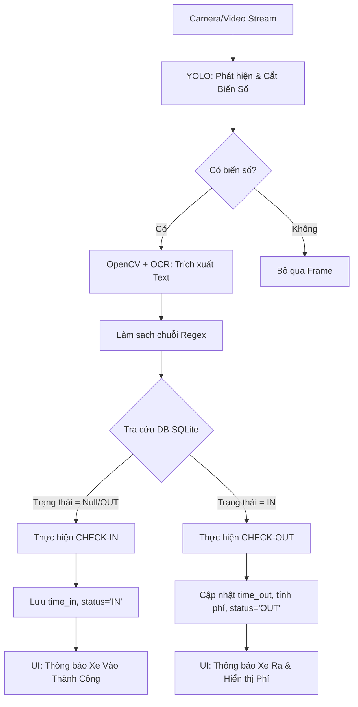

# Lộ trình Phát triển Dự án Smart Parking (5 Tuần)

Dự án Xây dựng hệ thống Nhận diện Biển số xe (License Plate Recognition - LPR) kết hợp YOLO (phát hiện đối tượng), OpenCV (xử lý ảnh) và OCR (nhận dạng ký tự).

---

## 🎯 1. Mục tiêu dự án
- **Hệ thống hóa toàn diện:** Xây dựng một hệ thống Quản lý Bãi xe Thông minh (Smart Parking) tích hợp công nghệ nhận diện bằng AI.
- **Tự động hóa:** Xử lý luồng Check-in/Check-out tự động (phát hiện xe, đọc biển số, lưu thời gian, tính toán phí gửi).
- **Quản lý lưu trữ:** Triển khai cơ sở dữ liệu SQLite để lưu vết (logs) xe ra vào, hỗ trợ truy xuất và đối soát doanh thu.
- **Giao diện trực quan:** Xây dựng dashboard giám sát (UI) thời gian thực bằng Streamlit phục vụ cho bảo vệ và người quản lý.

---

## 🛠️ 2. Công nghệ & Công cụ (Tech Stack & Tools)

### 2.1. Ngôn ngữ & Framework
- **Ngôn ngữ:** Python 3.9+
- **Deep Learning Framework:** PyTorch (dành cho các phiên bản YOLO mới).
- **Computer Vision:** OpenCV (`cv2`).

### 2.2. Các module chính
1. **Phát hiện biển số (Object Detection):**
   - **Mô hình:** YOLOv11 (hoặc YOLOv8). Xử lý frame video thời gian thực để tìm xe và vùng biển số.
2. **Xử lý ảnh & OCR (Image Processing & Recognition):**
   - **Công cụ:** OpenCV (làm nét, nhị phân hóa) và PaddleOCR (đọc chuỗi ký tự).
3. **Quản lý Dữ liệu (Database Management):**
   - **Công cụ:** SQLite3.
   - **Nhiệm vụ:** Lưu trữ bảng `parking_logs` với các trường thông tin: Biển số, Thời gian vào, Thời gian ra, Trạng thái (IN/OUT), Phí gửi xe.
4. **Giao diện Giám sát (Dashboard UI):**
   - **Công cụ:** Streamlit.
   - **Nhiệm vụ:** Hiển thị camera stream, trạng thái xử lý xe, in thông báo Check-in/Check-out và thống kê phí.

### 2.3. Tools & Environment
- **IDE:** VS Code / PyCharm / Jupyter Notebook (để test/train model).
- **Quản lý môi trường:** Anaconda hoặc `venv`.
- **Đánh dấu dữ liệu (Annotation Tool):** CVAT, LabelImg, hoặc Roboflow (khuyên dùng Roboflow).
- **Phần cứng:** Ưu tiên có GPU (NVIDIA CUDA) để train/test mô hình YOLO nhanh hơn.

---

## 🗺️ 3. Lộ trình phát triển (Roadmap) - Đẩy nhanh tiến độ (5 Tuần)

### Tuần 1-2: Xây dựng Core AI (Hoàn thành)
- Huấn luyện YOLO nhận diện biển số (best.pt).
- Thiết lập Pipeline xử lý ảnh bằng OpenCV.

### Tuần 3: Tích hợp OCR & Cơ sở dữ liệu (Hiện tại)
- Triển khai PaddleOCR để trích xuất text.
- Thiết kế Schema SQLite (Bảng `parking_logs`).
- Viết hàm `check_in()` và `check_out()` tương tác với Database.

### Tuần 4: Phát triển Giao diện & Logic tính phí
- Xây dựng Dashboard Streamlit (Màn hình vào/ra).
- Cài đặt công thức tính phí theo thời gian gửi.
- Xử lý các trường hợp ngoại lệ (Biển số lỗi, xe chưa có thông tin vào).

### Tuần 5: Kiểm thử & Đóng gói
- Test thực tế với Video bãi xe.
- Hoàn thiện báo cáo và Slide thuyết trình.

---

## 📋 4. Sơ đồ Pipeline xử lý Bãi xe (Smart Parking Workflow)



---

## 🛠️ 5. Các vấn đề thường gặp (Gotchas / Challenges)
1. **Biển số bị chói sáng / phản quang (Ban đêm):** Giải quyết bằng cách dùng `cv2.equalizeHist` hoặc các thuật toán cân bằng sáng trước khi đưa vào OCR.
2. **Biển bị mờ do xe chạy tốc độ cao (Motion Blur):** Tương đối khó xử lý bằng OpenCV thuần, ưu tiên cải thiện chất lượng Camera đầu vào hoặc áp dụng các model AI khôi phục ảnh (Super Resolution).
3. **Biển vuông (2 dòng) bị OCR đọc sai thứ tự:** Cần viết code logic tính toán toạ độ chiều dọc (Y-coordinate) của các ký tự để nối chuỗi (dòng trên trước, dòng dưới sau).
4. **Nhầm lẫn ký tự:** Cần sử dụng Regular Expression (RegEx) dựa trên quy tắc biển số (Ví dụ: ký tự thứ 3 thường là chữ cái trong biển dân sự xe máy/ô tô mới) để tự động mapping đổi `8` thành `B`, `0` thành `D` (nếu ở vị trí chữ), v.v.

---

## 🚉 5. Cấu trúc Module của Hệ thống Bãi xe (Smart Parking Modules)

Hệ thống được chia thành 4 Module hoạt động song song để quản lý toàn diện quy trình:

| Module | Tên | Công nghệ | Nhiệm vụ |
|--------|-----|-----------|----------|
| **Module 1** | Capture (Camera) | OpenCV / Streamlit | Quản lý luồng video (Real-time feed) từ cổng vào/ra. |
| **Module 2** | AI Core (LPR) | YOLO + PaddleOCR | Xác định và trích xuất chuỗi biển số từ khung hình. |
| **Module 3** | DB Logic (Ticket) | SQLite3 + Python | Quyết định Check-in/Check-out, ghi nhận log và tính tiền. |
| **Module 4** | Dashboard (UI) | Streamlit | Giám sát trạng thái hoạt động, báo cáo doanh thu. |

### 🚉 Module 1 & 2 — AI LPR (Cốt lõi nhận diện)
- Luồng video được quét mỗi `n` frame (skip frames) để giảm tải.
- **YOLOv11** phát hiện hộp giới hạn xe và biển số.
- Vùng biển số được cắt, tăng độ tương phản (CLAHE) bằng **OpenCV** và chuyển thành văn bản bằng **PaddleOCR**.
- **RegEx** làm sạch kết quả: `30G-123.45#` → `30G12345`.

### 🚉 Module 3 — DB & Billing Logic (Trạm ra/vào)
- Module kiểm tra chuỗi biển số với bảng `parking_logs` trong cơ sở dữ liệu.
- **Kịch bản Check-in (Vào):** Nếu biển số chưa có trong DB hoặc trạng thái cũ là 'OUT'. Lưu `ticket_id`, `plate_number`, `time_in` (thời gian hiện tại), và đánh dấu `status = 'IN'`.
- **Kịch bản Check-out (Ra):** Nếu biển số đang có trạng thái 'IN'. Lấy `time_in` đối chiếu với `time_out` (hiện tại) để tính tổng số giờ gửi. Ghi nhận số tiền (`fee`) và cập nhật `status = 'OUT'`.

### 🚉 Module 4 — Giám sát & Báo cáo
- Giao diện Admin hiển thị bảng danh sách các xe đang đỗ.
- Màn hình thông báo pop-up số tiền phí đối với xe Check-out.

---

## 📁 6. Cấu trúc Thư mục Dự án (File Structure)

```
LPR_Project/
├── parking.db                # File Database lưu vết xe ra vào
├── models/
│   └── best.pt               # YOLO model đã train phát hiện biển số
├── modules/
│   ├── database_manager.py   # Logic DB: Tính phí, Check-in/Check-out
│   ├── detection.py          # Logic nhận diện biển số (gọi YOLO, trả bbox)
│   ├── processing.py         # Tiền xử lý ảnh (OpenCV pipeline)
│   ├── ocr_engine.py         # Nhận dạng chữ (PaddleOCR + RegEx)
│   ├── ocr_worker_proc.py    # Worker chạy OCR trong process riêng
│   └── live_test.py          # Script chạy camera ngoài (OpenCV)
├── app.py                    # File chính của bản cũ (Streamlit UI gốc)
├── app_trial.py              # File chính bản nâng cấp (Giao diện Streamlit đầy đủ tính năng)
├── requirements.txt          # Danh sách thư viện cần cài đặt
└── Implementation_Guide.md   # File hướng dẫn chi tiết từng bước
```

> **Quy tắc chính:** Mỗi `module` trong thư mục `modules/` phải export ít nhất 1 hàm rõ ràng. `app_trial.py` chỉ import và gọi các hàm đó, không chứa logic xử lý ảnh hay OCR trực tiếp.

---

## ⚡ 7. Giải pháp cho các vấn đề thực tế

### 🔴 Vấn đề 1: Train dữ liệu nhanh để nhận diện Real-time

| Giải pháp | Chi tiết |
|-----------|---------|
| **Dùng model Pre-trained** | Dùng `yolov8n.pt` (Nano) — bản nhẹ nhất, FPS cao, không cần GPU mạnh. |
| **Dataset sẵn có** | Tìm "Vietnamese License Plate" trên **Roboflow** — đã gán nhãn sẵn, bỏ qua bước labeling thủ công. |
| **Train trên Cloud** | Dùng **Google Colab** (GPU miễn phí) — train xong trong vài tiếng thay vì vài ngày. |

### 🟠 Vấn đề 2: Xử lý Trùng lặp Biển số & Lưu Database

- **Vấn đề Quét nhiều lần (Spam Scan):** Xe dừng ở cổng có thể bị hệ thống quét nhiều lần trong 1 giây, dẫn đến lưu nhiều bản ghi Check-in.
- **Giải pháp - Buffer & Timeout:** Dùng cơ chế đệm (Buffering). Chỉ ghi Check-in khi **kết quả biển số xuất hiện ổn định trong 3 frame liên tiếp**. Đồng thời, áp dụng Cooldown Time (ví dụ: Biển số X vừa Check-in thì bỏ qua nếu quét lại X trong 1 phút tới).
- **Vấn đề Xe mất biển / Lỗi OCR:** Yêu cầu bảo vệ nhập biển số bằng tay thông qua một input box trên UI nếu AI không đọc được hoặc đọc sai.

### 🟢 Vấn đề 3: Giải pháp cho người mới (Dễ triển khai)

| Vấn đề | Giải pháp nhanh |
|--------|----------------|
| Giao diện web | **Streamlit** — viết Python thuần, không cần HTML/CSS/JS. |
| Đọc chữ (OCR) | **PaddleOCR** — hỗ trợ đa ngôn ngữ, ổn định ngay cả ảnh hơi mờ. |
| Real-time quá chậm | **Plan B:** Upload Video → Xử lý → Trả kết quả (thay vì live webcam). |

### 🔵 Kỹ thuật nâng cao: Giảm Delay khi chạy Video/Webcam

```
Chiến lược giảm tải:
1. Skip Frames  →  YOLO: mỗi frame | OCR: mỗi 5–10 frames (hoặc khi biển số ổn định)
2. Multi-processing  →  Thread 1: YOLO detection | Thread 2: OCR + Post-processing
3. Plan B  →  Upload Video → Xử lý offline → Hiển thị kết quả cuối
```

---
*Bản kế hoạch này cung cấp một cái nhìn tổng thể và có thể được điều chỉnh linh hoạt độ khó, sâu của từng Phase tuỳ thuộc vào thời gian và yêu cầu cụ thể của bạn.*
